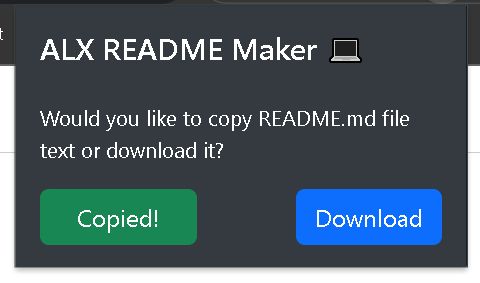
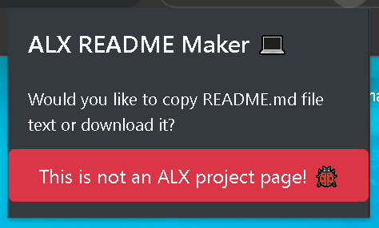

# README Maker Extension

A Chrome extension for generating README.md files for ALX projects.

## Description
The README Maker Extension is a Chrome extension with a simple, intuitive interface that automates the creation of README.md files for ALX projects. It extracts relevant information from ALX project pages and generates a README.md file with the project name, learning objectives, and tasks with associated files. Users can then copy or download the generated README.md file.

## Features

- Extracts project name, learning objectives, and tasks with associated files from ALX project pages.
- Generates a formatted README.md file with the extracted information.
- Supports both mandatory and advanced tasks.
- Creates a table of tasks and associated files.
- Organizes learning objectives by categories.
- Copy or download generated README.md file

## Installation

1. Clone this repository: `git clone https://github.com/TutTrue/README-maker-extention.git`.
2. Open Google Chrome and navigate to `chrome://extensions`.
3. Enable "Developer mode" by toggling the switch at the top right corner.
4. Click on "Load unpacked" and select the cloned repository folder.

## Usage
#### youtube [video](https://www.youtube.com/watch?v=HEsgoJOjG5Y&ab_channel=nuuX) by [Mounssif](https://github.com/nuuxcode)

### OR

1. Open the ALX project page in Chrome at `https://intranet.alxswe.com/projects/`.
2. Click on the ALX README Maker extension icon in the toolbar to open extension popup window.
3. Click on Copy or Download button.
4. The extension will extract the necessary information from the page and generate a README.md file.

## License

This project is licensed under the [MIT License](LICENSE).

## Contributions

Contributions to this project are welcome. Feel free to open issues and submit pull requests.

## Authors

<b> - Mahmoud Hamdy : </b>

<b> - Emad Anwer : </b>

